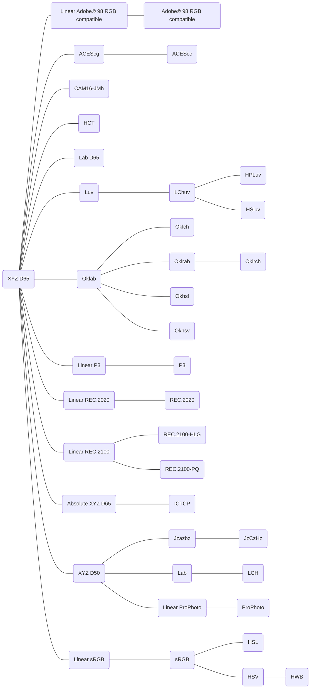

# Design Decisions

## AI Focused

* Extensive TypeDoc documentation with `@example`s on everything.
* Embed as much information in the type system as possible.
* AI assistants don't run code, so optimize for compile-time checking.

## Conversion Graph

[Color.js] uses a tree for converting between colors with a "base" color that gets converted between. A more generic graph would be better for tree shaking since you don't need to include both the to and from conversions always.




[Color.js]: https://colorjs.io/docs/spaces

## Dynamic and Static APIs

Give uses the choice between a dynamic dispatcher and static pipe API with different trade-offs.

1. Dynamic dispatcher
   * Focus on simplicity and ease of use
   * Don't care about the implementation details of the library-just pass two keys
   * Support A -> C at runtime, where A and C are distant keys in the graph.
   * Some dead-code elimination via pre-built graph subsets.
2. Static pipe
   * Strict build requirements and efficiency
   * Dead-code elimination works perfectly—only the functions needed end up in the bundle
   * Full end-to-end type safety

## Simplicity vs Accuracy

### CSS Color Strings

The CSS grammar for color representation is rather broad, allowing for a wide range of inputs and number formats. Matching the CSS spec exactly pretty much requires proper tokenization and parsing. In the spirit of providing a simpler string option that will still handle some CSS strings, the from\*String, is\*String, and to\*String functions only convert from one fixed CSS representation of a color. For this simple representation, I went with the most common format described in developer.mozilla.org, w3schools.com, and codecademy.com. Even though not all spec-compliant _input_ strings will be parsed, the _output_ string will always be a valid CSS string.

#### RGB Color Strings

`rgba(127, 127, 127, 0.5)` and `rgb(127, 127, 127)`

sRGB values are in the range \[0,255] (floating-point is accepted) and the alpha is in the range \[0,1]. The alpha is only included in the output if the value is less than one. The input parsing is still somewhat lenient—strings will still be parsed if the input includes an alpha value of one, and `rgb` and `rgba` are treated as identical. Invalid input strings for this simplified version include space-delimited notation and percentage values.

#### HSL Color Strings

`hsla(180, 50%, 50%, 0.5)` and `hsl(180, 50%, 50%)`

Angles are unit-less which means degrees, hue and saturation are as percentages, and alpha is a number in the range [0,1]. The alpha is only included in the output if the value is less than one.

#### Fully-compliant CSS String Parsing

If you truly want to parse _any_ valid CSS color string or customize the output, a set of spec-compliant functions from\*Css, is\*Css, and to\*Css will be provided in the future.

## Errors

Parsing colors has a lot of opportunity for a wide variety of errors. I've always found the try/catch mechanism really clunky so there are a couple other options: returning the error or returning null. I like how `Maybe` works in other languages, but in TypeScript it requires an awkward switch/case or if/else _and_ an awkward object wrapper.

After considering the options, I think I'm still going to go with the try/catch. It's not worth confusing people over a negligible performance increase (performance-critical applications should use [colr-convert]) and slightly more condensed code (see examples below).

### Returning `null` instead of throwing

You can still get the convenient `null` behavior if you don't care about error types by wrapping calls in an error handling function.

[neverthrow]: https://github.com/supermacro/neverthrow

```ts
import { fromAny as _fromAny } from "color-fns"

function fromThrowable(f, asNull) {
	return (...args) => {
		try {
			return f(...args)
		} catch (e) {
			return asNull ? null : e
		}
	}
}

const fromAny = fromThrowable(_fromAny, true)
```

### Using a library like `neverthrow`

The same method can be used for converting to a library like [neverthrow].

```ts
import { Result } from "neverthrow"
import { fromAny as _fromAny } from "color-fns"

type ParseError = { message: string }
const toParseError = (): ParseError => ({ message: "Parse Error" })
const fromAny = Result.fromThrowable(_fromAny, toParseError)
```

### example using `throw`

Pros: This is how `date-fns` handles errors. Probably how most people expect errors to be handled.

Cons: Ugly, takes up a lot of space, need to use a `let`. Maybe marginally slower performance.

```tsx
function MyComponent() {
	const colorRef = useRef()

	let rgb
	try {
		rgb = convert(fromHex, toRGB, colorRef.current.value)
	} catch (e) {
		rgb = "Could not convert"
	}

	return (
		<div>
			<label>
				Color:
				<input type="text" ref={colorRef} />
			</label>
			<span>As RGB: {rgb}</span>
		</div>
	)
}
```

### example using `return null`

Pros: Very convenient with the `??` operator.

Cons: No error type available to see why the error happened.

```tsx
function MyComponent() {
	const colorRef = useRef()

	const rgb = convert(fromHex, toRGB, colorRef.current.value) ?? ""

	return (
		<div>
			<label>
				Color:
				<input type="text" ref={colorRef} />
			</label>
			<span>As RGB: {rgb}</span>
		</div>
	)
}
```

### example using `return Error`

Pros: Ternary is still pretty convenient, and also still have error messages.

Cons: Less convenient than using `null`, don't think I've ever seen a library use this method.

```tsx
function MyComponent() {
	const colorRef = useRef()

	const converted = convert(fromHex, toRGB, colorRef.current.value)
	const rgb = converted instanceof RangeError ? "Could not convert" : converted

	return (
		<div>
			<label>
				Color:
				<input type="text" ref={colorRef} />
			</label>
			<span>As RGB: {rgb}</span>
		</div>
	)
}
```

### Default Coordinate Systems

Use a right-handed coordinate system when rotations are involved.
A positive rotation is counter-clockwise.
