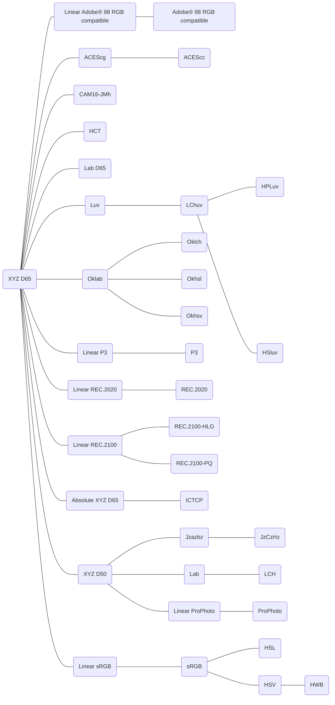

# Supported Color Spaces

This is the full list of color spaces that `color-tools` supports.

Each node represents an available color space.

Each edge represents an available conversion.

```mermaid
graph LR
    XYZ_D65("XYZ D65")

    Adobe_98_Linear("Linear Adobe® 98 RGB compatible")
    Adobe_98("Adobe® 98 RGB compatible")

    ACEScg("ACEScg")
    ACEScc("ACEScc")

    CAM16_JMh("CAM16-JMh")
    HCT("HCT")
    Lab_D65("Lab D65")
    Luv("Luv")
    LChuv("LChuv")
    HPLuv("HPLuv")
    HSluv("HSluv")

    Oklab("Oklab")
    Oklch("Oklch")
    Okhsl("Okhsl")
    Okhsv("Okhsv")

    P3_Linear("Linear P3")
    P3("P3")

    REC_2020_Linear("Linear REC.2020")
    REC_2020("REC.2020")

    REC_2100_Linear("Linear REC.2100")
    REC_2100_HLG("REC.2100-HLG")
    REC_2100_PQ("REC.2100-PQ")

    XYZ_D65_Absolute("Absolute XYZ D65")
    ICTCP("ICTCP")

    XYZ_D50("XYZ D50")
    Jzazbz("Jzazbz")
    JzCzHz("JzCzHz")
    Lab_D50("Lab")
    LCH("LCH")
    ProPhoto_Linear("Linear ProPhoto")
    ProPhoto("ProPhoto")

    sRGB_Linear("Linear sRGB")
    sRGB("sRGB")
    HSL("HSL")
    HSV("HSV")
    HWB("HWB")

    XYZ_D65 --- Adobe_98_Linear
    Adobe_98_Linear --- Adobe_98

    XYZ_D65 --- ACEScg
    ACEScg --- ACEScc

    XYZ_D65 --- CAM16_JMh
    XYZ_D65 --- HCT
    XYZ_D65 --- Lab_D65

    XYZ_D65 --- Luv
    Luv --- LChuv
    LChuv --- HPLuv
    LChuv --- HSluv

    XYZ_D65 --- Oklab
    Oklab --- Oklch
    Oklab --- Okhsl
    Oklab --- Okhsv

    XYZ_D65 --- P3_Linear
    P3_Linear --- P3

    XYZ_D65 --- REC_2020_Linear
    REC_2020_Linear --- REC_2020

    XYZ_D65 --- REC_2100_Linear
    REC_2100_Linear --- REC_2100_HLG
    REC_2100_Linear --- REC_2100_PQ

    XYZ_D65 --- XYZ_D65_Absolute
    XYZ_D65_Absolute --- ICTCP

    XYZ_D65 --- XYZ_D50
    XYZ_D50 --- Jzazbz
    Jzazbz --- JzCzHz
    XYZ_D50 --- Lab_D50
    Lab_D50 --- LCH
    XYZ_D50 --- ProPhoto_Linear
    ProPhoto_Linear --- ProPhoto

    XYZ_D65 --- sRGB_Linear
    sRGB_Linear --- sRGB
    sRGB --- HSL
    sRGB --- HSV
    HSV --- HWB
```
